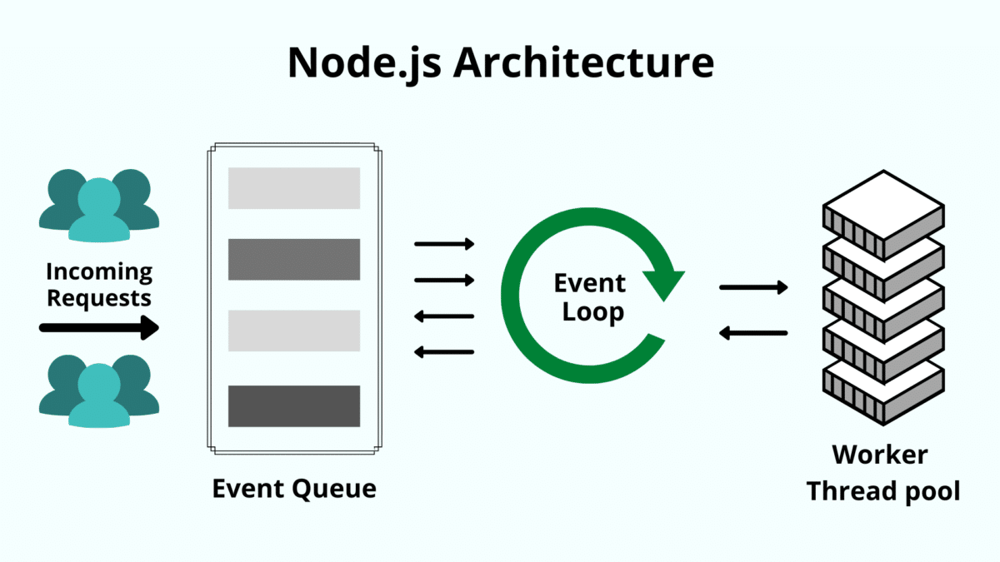
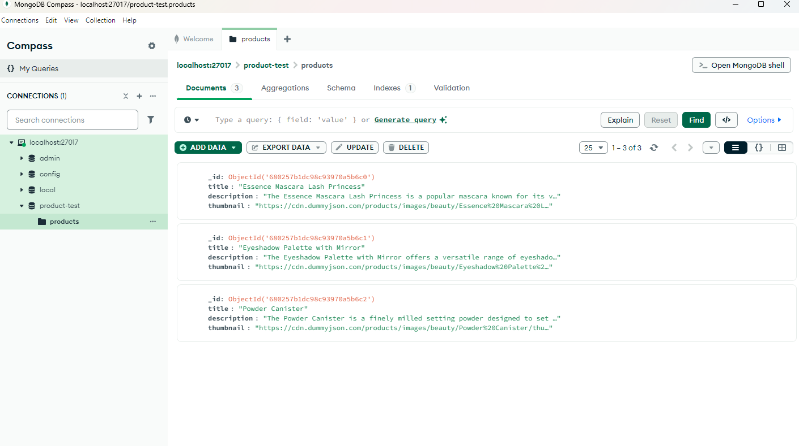
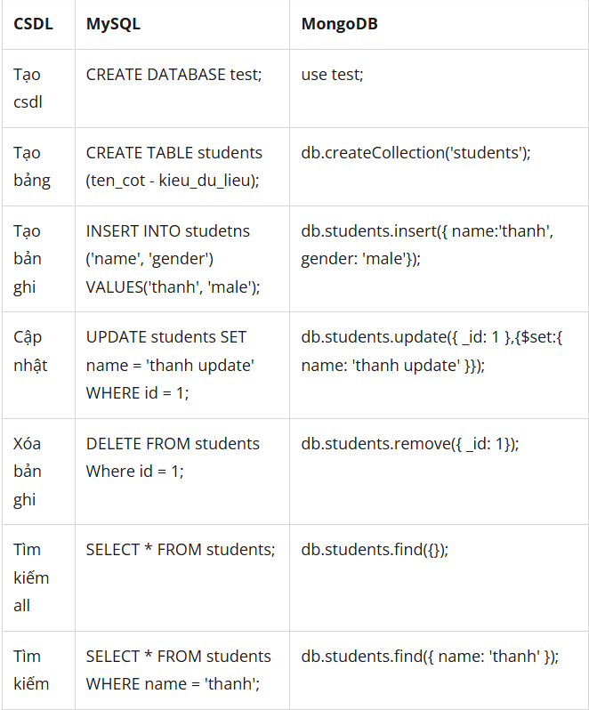
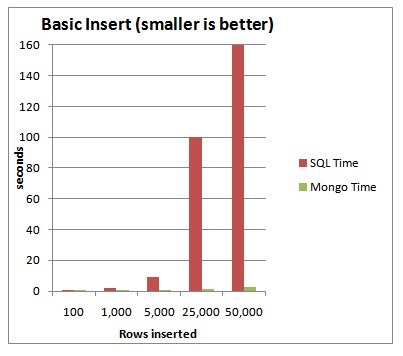
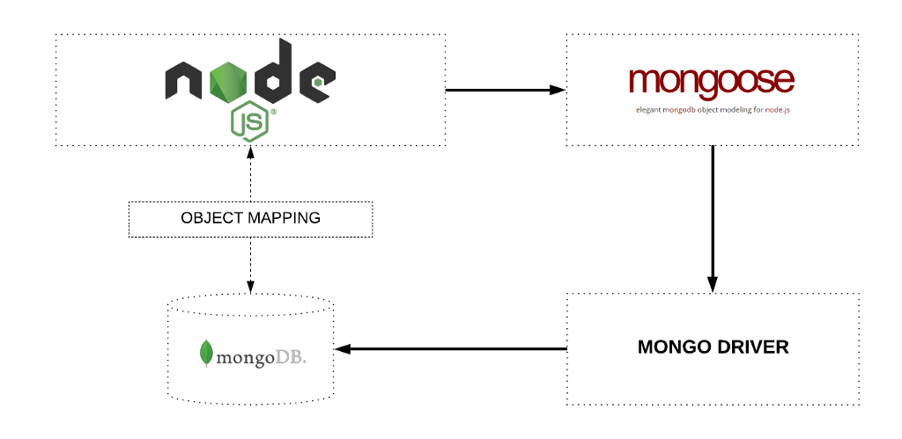
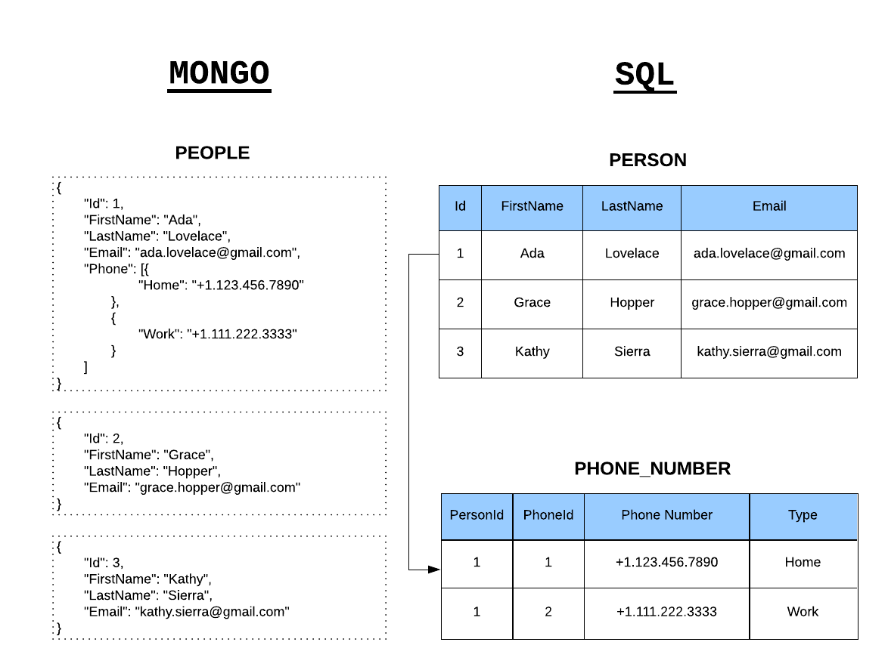
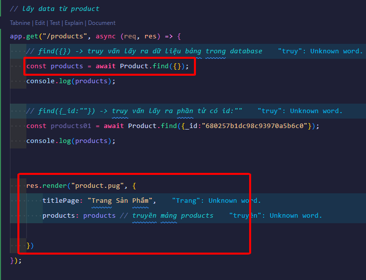
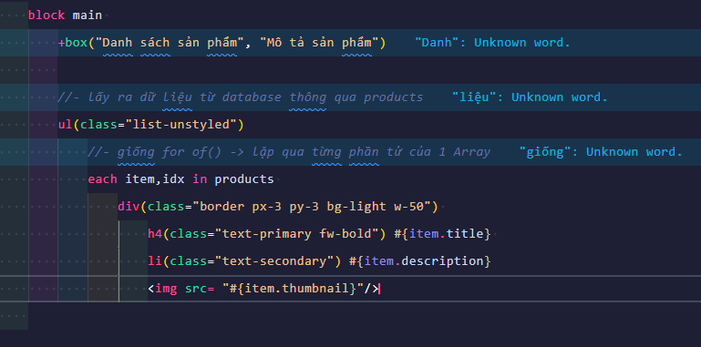

# 🚀 Series Học Node.js Từ A đến Z

- <b>Author: `@Vinhdev04`</b>
   
  
    
  > Học Node.js bài bản, dễ hiểu và thực chiến 🚀 – dành cho người mới bắt đầu đến khi làm được dự án thật!
  >    

---

## 📚 Giới thiệu Series

Chào mừng bạn đến với **series học Node.js**! Đây là chuỗi bài học được xây dựng nhằm giúp bạn:

- Hiểu rõ về **Node.js là gì**, vì sao nên học nó
- Làm quen với các khái niệm **core modules**: `http`, `fs`, `path`, `events`, ...
- Xây dựng **RESTful API** với `Express.js`
- Kết nối với cơ sở dữ liệu như **MongoDB**, **MySQL**
- Deploy project thực tế

> 👨‍💻 Không chỉ lý thuyết, bạn sẽ được **code thực tế** và làm **dự án nhỏ** để ôn lại kiến thức.

---

## 🧱 Cấu trúc nội dung

| STT | Chủ đề             | Nội dung chính                             |
| --- | ------------------ | ------------------------------------------ |
| 1️⃣  | Giới thiệu Node.js | Cài đặt, Hello World, mô hình event-driven |
| 2️⃣  | Modules & Packages | Exports, Imports, npm, tạo module riêng    |
| 3️⃣  | File System        | Đọc/ghi file, đồng bộ & bất đồng bộ        |
| 4️⃣  | HTTP Module        | Tạo web server, xử lý request/response     |
| 5️⃣  | Express.js         | Middleware, routes, controller             |
| 6️⃣  | MongoDB            | Kết nối database, CRUD cơ bản              |
| 7️⃣  | Dự án mini         | API quản lý user hoặc blog đơn giản        |
| 8️⃣  | Deploy             | Đưa code lên hosting/VPS                   |

---

## 🎯 Mục tiêu sau series này

- ✅ Hiểu rõ cách hoạt động của Node.js
- ✅ Tự tin xây dựng API với Express
- ✅ Biết deploy project cơ bản
- ✅ Là nền tảng vững chắc để học thêm: `NestJS`, `GraphQL`, `WebSocket`, v.v.

---

### Minh họa hoạt động server đơn giản

---

## 🎯 Dự án series này

---

## 📌 Yêu cầu kiến thức nền

Trước khi học series, bạn nên có kiến thức cơ bản về:

- HTML / CSS / JavaScript (ES6+)
- Làm việc với Terminal / Command Line
- Biết dùng Git và VSCode là một lợi thế

---

## 💡 Mẹo học hiệu quả

- 📓 Ghi chú lại những gì bạn hiểu, đừng chỉ copy code
- ❓ Đặt câu hỏi nếu chưa hiểu
- 🔁 Xem lại các bài cũ sau 2–3 ngày
- 🧪 Thử nghiệm thêm với các ví dụ ngoài bài giảng

---

## 🛠 Công cụ hỗ trợ

- Node.js v18+
- Postman / Thunder Client
- MongoDB Atlas (hoặc Mongo Compass)
- VSCode + tiện ích ESLint, Prettier

---

## ❤️ Cảm ơn bạn đã theo dõi!

> Nếu thấy series hữu ích, hãy ⭐ repo này và chia sẻ cho bạn bè nhé!

 

### ExpressJS

- <i>`ExpressJS` là một framework đê xây dựng các ứng dụng website trong `NodeJS`</i>
- <i>`ExpressJS` giúp quá trình xây dựng `Server` đơn `giản hơn` với `nhiều tính năng đuợc xây dựng sẵn`</i>
- Install: `npm i express`

---

### Cách chạy dự án:

- B1: Tạo folder `HelloWorld` và chạy `npm init`
- B2: Cài ExpressJS `npm i express`
- B3: Tạo file `file_name.js` và code
- B4: Run terminal `node file_name.js`
- <b>Lưu ý: `NodeJS chỉ chạy 1 lần và ko tự động reload lại trang`</b>

---

### Cài Nodemon

- <i>Giúp tự động khởi động lại ứng dụng khi có sự thay đổi của file </i>
- B1: Chạy câu lệnh: `npm install -g nodemon `
- B2: Thêm dòng `"start": "nodemon --inspec file_name.js` vào `script` trong `package.json`, `--inspec giúp tạo ra tab console nodeJS ở phía Server `
- B3: Run `npm start`

---

### Sử dụng Routing cơ bản

- <b>Exam: Tạo routing `products` </b>:
  `app.get("/products", (req, res) => {
    res.send("Products"); // phản hồi
});`

---

### SPA và MPA

- <b>`Multiple Page Application` là gì?</b>
- <i>`MPA` là khi người dùng truy cập các `trang con` trên website thì `server` sẽ xử lý và `trả về toàn bộ trang web và nó sẻ bị load mới lại hoàn toàn` </i>
- <i>Theo hướng Server Side Rendering</i>
- ## <i>Ví du: Tiki,Shopee,sendo</i>
- <b>`Single Page Application` là gì?</b>
- <i>`SPA` là khi người dùng truy cập các `trang con` trên website, `website chỉ load lại những phần giao diện thay đổi, những phần không thay đổi sẻ không bị load lại`</i>
- <i>Theo hướng Client Side Rendering</i>
- <i>Ví dụ: facebook,instagram,gmail,....</i>

---

### SSR và CSR

- <b>`Server Side Rendering` là gì?</b>
- <i>HTML đuợc `render` sẵn từ `server` gửi về cho `client`</i>
- ## <i>Trình duyệt nhận được trang đầy đủ `đã render sẵn`, nhanh cho SEO và giảm thời gian tải ban đầu </i>
- <b>`Client Side Rendering` là gì?</b>
- <i>`Server` chỉ gửi `HTML trống + Javascript`</i>
- <i>`Trình duyệt` sẻ dùng `Javascript` để `render` nội dung sau khi tải xong</i>
- <i>Trải nghiệm mượt sau lần tải đầu nhưng SEO kém hơn, vì bot không thấy nội dung sẵn.</i>

---

### Template Engines

- <b>Khái niệm</b>
- <i>`Template Engines` là `công cụ giúp tách mã HTML thành các phần nhỏ hơn`</i>
- <i>Đê tái sử dụng lại trên nhiều file HTML</i>
- <b>Một số Template Engines phô biến:</b>
- <i>`PUG`</i>
- <i>`EJS`</i>
- <i>`Handlebars`</i>
- <b>Sử dụng `PUG`</b>
- <i>Cài đặt: `npm install pug`</i>
- <i>Tài liệu: `[npm install pug](https://pugjs.org/api/getting-started.html)`</i>  
  ` // sử dụng pug làm view engine`
  ` app.set("views", "./views");` 
  ` // import pug`
  ` app.set("view engine", "pug");`

---

### Biên dịch HMTL Trong PUG:

- <i>`Tags (thẻ): `</i>  
- <i>`Attributes: `</i>  
- <i>`Comments: `</i>  
- <i>`Variables: `</i>  
- <i>`Variables: `</i>  
- <i>`Conditionals: `</i>  
- <i>`Case: `</i>  
- <i>`Iteration: `</i>  

---

### Template Inheritance (kê thừa mẫu)

- <i>Dùng để tạo ra một bộ khung dùng chung cho nhiều trang</i>
- <i>Cho phép kế thừa layout từ file khác,</i>
- <i>override các block nội dung.</i>
- <i>`Bước 01` </i> 
- <i>`Bước 02` </i>

---

### Includes

- <i>Dùng để nhúng nội dung của 1 file PUG vào 1 file PUG khác</i>
- <i>Không hỗ trợ block, không override.</i>
- <i>Thích hợp cho các phần tử tĩnh, lặp lại như: header, footer, sidebar...</i>
- <i>`Bước 01` </i> 
- <i>`Bước 02` </i>

---

### Mixins

- <i>Dùng để tạo ra các khối có thể tái sử dụng</i>
- <i><b>Bản chất</b>Là việc tự định nghĩa hàm và truyền tham số vào - thông qua gọi hàm để tái sử dụng</i>
- <i>`Bước 01` </i> 
- <i>`Bước 02` </i>

---

### Giới thiệu dự án thực tế

- <b>`Trang phía người dùng (client)`</b>
- <b>`Trang phía quản trị viên (admin)`</b>

---

### Tìm hiểu kiến thức cơ bản MongoDB

- <i>`MongoDB` là `cơ sở dữ liệu` được thiết kê theo hướng `đối tượng`</i>
- <i>`MongoDB` là một cơ sở dữ liệu `NoSQL`</i>
- <i>Mô hình: `Database - Collection - Document`</i>
- <i>Download: `https://www.mongodb.com/try/download/community`</i>
- <b>Lưu ý: Trong lúc cài mongoDB `cài thêm MongoDB Compass` -> phần mềm để quản lý `database` có giao diện trực quan</b>  
  

---

### Kiến thức về MongoDB

#### NoSql(cơ sở dữ liệu phi quan hệ ) là gì?

- <i>`NoSQL` là 1 dạng `CSDL` mã nguồn mở: `Non-Relational SQL hay còn gọi Not-Only SQL`</i>
- <i>`NoSQL` được phát triên dựa trên `Javascript Framework` với kiểu dữ liệu là `JSON (Key-Value)`</i>
- <i>`NoSQL` ra đời nhằm khắc phục khuyết điểm và thiếu xót của `mô hình dữ liệu quan hệ RDBMS (Relational Database Management System- Hê Quản Tri Cơ Sở Dữ Liệu)` vê tốc độ ,tính năng và khả năng mở rộng,...</i>
- <i>`NoSQL` bỏ qua tính toàn vẹn của dữ liệu và transaction để đổi lấy hiệu suất nhanh và khả năng mở rộng.</i>
- <i>`NoSQL` bạn có thể mở rộng dữ liệu mà không lo tới những việc như tạo khóa ngoại, khóa chính, kiểm tra ràng buộc .v.v ...</i>  

---

- <b>`Tạo csdl`: use test </b>
- <b>`Tạo bảng`: db.createCollection('')</b>
- <b>`Tạo bản ghi`: db.table\_\_name.insert({key:'value'})</b>
- <b>`Cập nhật`: db.table\_\_name.updated({key:'value'})</b>
- <b>`Xóa bản ghi`: db.table\_\_name.remove({\_id})</b>
- <b>`Tìm kiếm all`: db.table\_\_name.find({})</b>
- <b>`Tìm kiếm`: db.table\_\_name.find({name: 'A'})</b>

---

#### MongoDB là gì?

- <i>`MongoDB` là một hệ quản trị cơ sở dữ liệu mã nguồn mở, là CSDL thuộc NoSql và được hàng triệu người sử dụng.</i>
- <i>Với CSDL quan hệ chúng ta có khái niệm bảng, các cơ sở dữ liệu quan hệ (như MySQL hay SQL Server...) sử dụng các bảng để lưu dữ liệu thì với `MongoDB` chúng ta sẽ `dùng khái niệm` là `collection` thay vì bảng</i>
- <i>So với RDBMS thì trong `MongoDB collection ứng với table`, còn `document sẽ ứng với row` , `MongoDB sẽ dùng các document thay cho row` trong RDBMS.</i>

---

#### Ưu điểm của mongoDB

- <i>linh hoạt trong việc lưu trữ dữ liệu, nên bạn muốn gì thì cứ insert vào thoải mái</i>
- <i>xóa hay update nó không cần phải mất thời gian kiểm tra xem có thỏa mãn các ràng buộc dữ liệu như trong RDBMS.</i>
- <i>Khi có một truy vấn dữ liệu, bản ghi được cached lên bộ nhớ Ram, để phục vụ lượt truy vấn sau diễn ra nhanh hơn mà không cần phải đọc từ ổ cứng.</i>
- <i>Hiệu năng cao: Tốc độ truy vấn (find, update, insert, delete) của MongoDB nhanh hơn hẳn so với các hệ quản trị cơ sở dữ liệu quan hệ (RDBMS).</i>  
  

---

#### Nhuợc điểm của mongoDB

- <i>MongoDB không có các tính chất ràng buộc như trong RDBMS nên khi thao tác với mongoDB thì phải hết sức cẩn thận.</i>
- <i>Tốn bộ nhớ do dữ liệu lưu dưới dạng key-value, các collection chỉ khác về value do đó key sẽ bị lặp lại. Không hỗ trợ join nên dễ bị dữ thừa dữ liệu.</i>
- <i>Khi insert/update/remove bản ghi, MongoDB sẽ chưa cập nhật ngay xuống ổ cứng, mà sau 60 giây MongoDB mới thực hiện ghi toàn bộ dữ liệu thay đổi từ RAM xuống ổ cứng điêù này sẽ là nhược điểm vì sẽ có nguy cơ bị mất dữ liệu khi xảy ra các tình huống như mất điện...</i>

### Tìm hiểu kiến thức cơ bản Mongoose

- <i>`Mongoose` là một thư viện `Object Data Modeling (ODM)`</i>
- <i>Thư viện `mô hình hóa dư liệu đối tượng cho MongoDB`</i>
- <i>`Mongoose` cho phép định nghĩa các Object với một `schema` được định nghĩa rõ ràng,được ánh xạ tới một MongoDB document</i>
- <i>Download: `npm i mongoose`</i>  
    
    

---

#### Thuật ngữ - Terminologies

**Collections**

- <i>`Collections` ở Mongo tương đương với các bảng trong các cơ sở dữ liệu quan hệ. Chúng có thể chứa nhiều tài liệu JSON.</i>

---

**Documents**

- <i>`Documents` tương đương với các bản ghi trong SQL. Mặc dù một dòng SQL có thể tham khảo dữ liệu trong các bảng khác, các tài liệu Mongo thường kết hợp trong một tài liệu.</i>

---

**Fields**

- <i>`Fields` thuộc tính tương tự như các cột trong một bảng SQL.</i>

---

**Schema**

- <i>Trong khi Mongo là `schema-less`, SQL định nghĩa một lược đồ thông qua định nghĩa bảng. Một lược đồ Mongoose là một lớp cấu trúc dữ liệu được thi hành qua lớp ứng dụng.</i>

---

### Kết nối NodeJS với MongoDB

**Ví dụ**

- <i>`Bước 1: ` kết nối tới mongoose, tạo cấu trúc truy vấn - kết nối tới database </i> 

  

- <i>`Buớc 2: ` lấy data từ product </i> 
  

- <i>`Bước 3: ` Tạo file product.pug</i> 
   
  **Lưu ý: tên biến thay đôi tùy ý (đúng cú pháp)**

---
