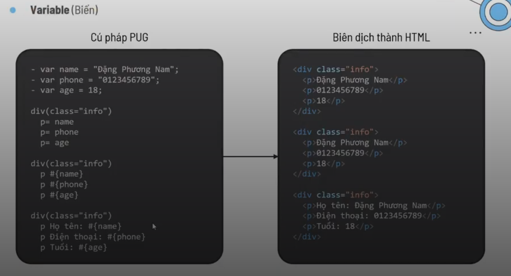
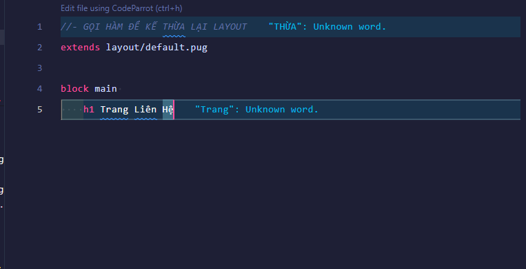
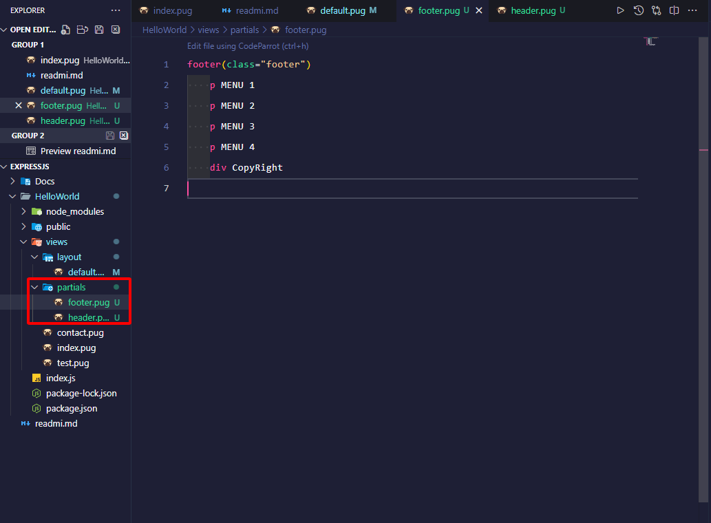
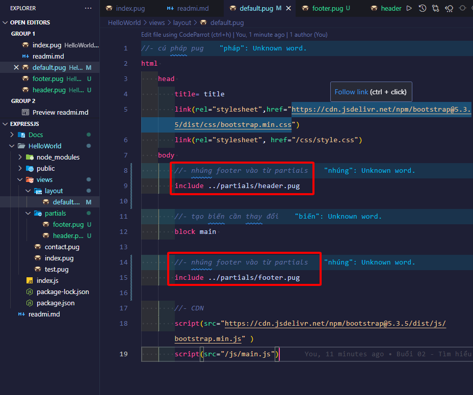
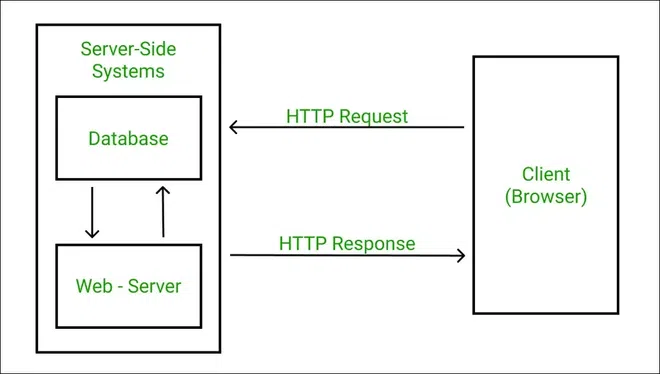
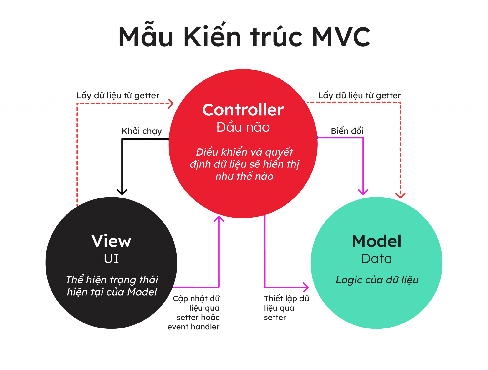
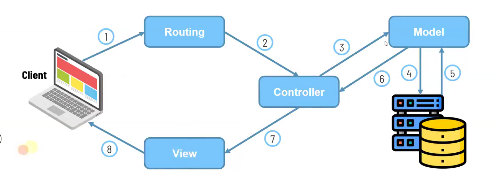

# 🚀 Series Học Node.js Từ A đến Z

- <b>Author: `@Vinhdev04`</b>
  <br>
  
  <br><br>
  > Học Node.js bài bản, dễ hiểu và thực chiến 🚀 – dành cho người mới bắt đầu đến khi làm được dự án thật!
  > <br> <br>

---

## 📚 Giới thiệu Series


Chào mừng bạn đến với **series học Node.js**! Đây là chuỗi bài học được xây dựng nhằm giúp bạn:

- Hiểu rõ về **Node.js là gì**, vì sao nên học nó
- Làm quen với các khái niệm **core modules**: `http`, `fs`, `path`, `events`, ...
- Xây dựng **RESTful API** với `Express.js`
- Kết nối với cơ sở dữ liệu như **MongoDB**, **MySQL**
- Deploy project thực tế

> 👨‍💻 Không chỉ lý thuyết, bạn sẽ được **code thực tế** và làm **dự án nhỏ** để ôn lại kiến thức.

---

## 🧱 Cấu trúc nội dung

| STT | Chủ đề             | Nội dung chính                             |
| --- | ------------------ | ------------------------------------------ |
| 1️⃣  | Giới thiệu Node.js | Cài đặt, Hello World, mô hình event-driven |
| 2️⃣  | Modules & Packages | Exports, Imports, npm, tạo module riêng    |
| 3️⃣  | File System        | Đọc/ghi file, đồng bộ & bất đồng bộ        |
| 4️⃣  | HTTP Module        | Tạo web server, xử lý request/response     |
| 5️⃣  | Express.js         | Middleware, routes, controller             |
| 6️⃣  | MongoDB            | Kết nối database, CRUD cơ bản              |
| 7️⃣  | Dự án mini         | API quản lý user hoặc blog đơn giản        |
| 8️⃣  | Deploy             | Đưa code lên hosting/VPS                   |

---

## 🎯 Mục tiêu sau series này

- ✅ Hiểu rõ cách hoạt động của Node.js
- ✅ Tự tin xây dựng API với Express
- ✅ Biết deploy project cơ bản
- ✅ Là nền tảng vững chắc để học thêm: `NestJS`, `GraphQL`, `WebSocket`, v.v.

---

### Minh họa hoạt động server đơn giản


---

---

## 📌 Yêu cầu kiến thức nền

Trước khi học series, bạn nên có kiến thức cơ bản về:

- HTML / CSS / JavaScript (ES6+)
- Làm việc với Terminal / Command Line
- Biết dùng Git và VSCode là một lợi thế

---

## 💡 Mẹo học hiệu quả

- 📓 Ghi chú lại những gì bạn hiểu, đừng chỉ copy code
- ❓ Đặt câu hỏi nếu chưa hiểu
- 🔁 Xem lại các bài cũ sau 2–3 ngày
- 🧪 Thử nghiệm thêm với các ví dụ ngoài bài giảng

---

## 🛠 Công cụ hỗ trợ

- Node.js v18+
- Postman / Thunder Client
- MongoDB Atlas (hoặc Mongo Compass)
- VSCode + tiện ích ESLint, Prettier

---

## 🧪 Dự án cuối khóa - Node.js

### 📌 Tên dự án: `<!-- điền tên dự án ở đây -->`

### 📂 Cấu trúc thư mục gợi ý

### ⚙️ Chức năng chính

## ❤️ Cảm ơn bạn đã theo dõi!

> Nếu thấy series hữu ích, hãy ⭐ repo này và chia sẻ cho bạn bè nhé!

<br>

### ExpressJS

- <i>`ExpressJS` là một framework đê xây dựng các ứng dụng website trong `NodeJS`</i>
- <i>`ExpressJS` giúp quá trình xây dựng `Server` đơn `giản hơn` với `nhiều tính năng đuợc xây dựng sẵn`</i>
- Install: `npm i express`

---

### Cách chạy dự án:

- B1: Tạo folder `HelloWorld` và chạy `npm init`
- B2: Cài ExpressJS `npm i express`
- B3: Tạo file `file_name.js` và code
- B4: Run terminal `node file_name.js`
- <b>Lưu ý: `NodeJS chỉ chạy 1 lần và ko tự động reload lại trang`</b>

---

### Cài Nodemon

- <i>Giúp tự động khởi động lại ứng dụng khi có sự thay đổi của file </i>
- B1: Chạy câu lệnh: `npm install -g nodemon `
- B2: Thêm dòng `"start": "nodemon --inspec file_name.js` vào `script` trong `package.json`, `--inspec giúp tạo ra tab console nodeJS ở phía Server `
- B3: Run `npm start`

---

### Sử dụng Routing cơ bản

- <b>Exam: Tạo routing `products` </b>:
  `app.get("/products", (req, res) => {
    res.send("Products"); // phản hồi
});`

---

### SPA và MPA

- <b>`Multiple Page Application` là gì?</b>
- <i>`MPA` là khi người dùng truy cập các `trang con` trên website thì `server` sẽ xử lý và `trả về toàn bộ trang web và nó sẻ bị load mới lại hoàn toàn` </i>
- <i>Theo hướng Server Side Rendering</i>
- ## <i>Ví du: Tiki,Shopee,sendo</i>
- <b>`Single Page Application` là gì?</b>
- <i>`SPA` là khi người dùng truy cập các `trang con` trên website, `website chỉ load lại những phần giao diện thay đổi, những phần không thay đổi sẻ không bị load lại`</i>
- <i>Theo hướng Client Side Rendering</i>
- <i>Ví dụ: facebook,instagram,gmail,....</i>

---

### SSR và CSR

- <b>`Server Side Rendering` là gì?</b>
- <i>HTML đuợc `render` sẵn từ `server` gửi về cho `client`</i>
- ## <i>Trình duyệt nhận được trang đầy đủ `đã render sẵn`, nhanh cho SEO và giảm thời gian tải ban đầu </i>
- <b>`Client Side Rendering` là gì?</b>
- <i>`Server` chỉ gửi `HTML trống + Javascript`</i>
- <i>`Trình duyệt` sẻ dùng `Javascript` để `render` nội dung sau khi tải xong</i>
- <i>Trải nghiệm mượt sau lần tải đầu nhưng SEO kém hơn, vì bot không thấy nội dung sẵn.</i>

---

### Template Engines

- <b>Khái niệm</b>
- <i>`Template Engines` là `công cụ giúp tách mã HTML thành các phần nhỏ hơn`</i>
- <i>Đê tái sử dụng lại trên nhiều file HTML</i>
- <b>Một số Template Engines phô biến:</b>
- <i>`PUG`</i>
- <i>`EJS`</i>
- <i>`Handlebars`</i>
- <b>Sử dụng `PUG`</b>
- <i>Cài đặt: `npm install pug`</i>
- <i>Tài liệu: `[npm install pug](https://pugjs.org/api/getting-started.html)`</i> <br>
  ` // sử dụng pug làm view engine`
  ` app.set("views", "./views");`<br>
  ` // import pug`
  ` app.set("view engine", "pug");`

---

### Biên dịch HMTL Trong PUG:

- <i>`Tags (thẻ): `</i><br><br>
- <i>`Attributes: `</i><br><br>
- <i>`Comments: `</i><br><br>
- <i>`Variables: `</i><br><br>
- <i>`Variables: `</i><br><br>
- <i>`Conditionals: `</i><br><br>
- <i>`Case: `</i><br><br>
- <i>`Iteration: `</i><br><br>

---

### Template Inheritance (kê thừa mẫu)

- <i>Dùng để tạo ra một bộ khung dùng chung cho nhiều trang</i>
- <i>Cho phép kế thừa layout từ file khác,</i>
- <i>override các block nội dung.</i>
- <i>`Bước 01` </i><br>
- <i>`Bước 02` </i>

---

### Includes

- <i>Dùng để nhúng nội dung của 1 file PUG vào 1 file PUG khác</i>
- <i>Không hỗ trợ block, không override.</i>
- <i>Thích hợp cho các phần tử tĩnh, lặp lại như: header, footer, sidebar...</i>
- <i>`Bước 01` </i><br>
- <i>`Bước 02` </i>

---

### Mixins

- <i>Dùng để tạo ra các khối có thể tái sử dụng</i>
- <i><b>Bản chất</b>Là việc tự định nghĩa hàm và truyền tham số vào - thông qua gọi hàm để tái sử dụng</i>
- <i>`Bước 01` </i><br>
- <i>`Bước 02` </i>

---


### Giới thiệu dự án thực tế

- <b>`Trang phía người dùng (client)`</b>
- <b>`Trang phía quản trị viên (admin)`</b>

---

### HTTP Request methods (Hypertext Transfer Protocol): Giao thức truyền siêu văn bản


#### GET

- `GET` được sử dụng để lấy thông tin từ `server` cung cấp
- `GET` chỉ nhận dữ liệu và không có ảnh hưởng gì tới dữ liệu.
- Dữ liệu sẽ được hiển thị ở URL dưới dạng tham số.

#### POST

- `POST` Một yêu cầu POST sử dụng các mẫu HTML để gửi dữ liệu tới máy chủ
- Có thể tạo mới hoặc thay đổi dữ liệu trên server.

#### HEAD

- `HEAD` Tương tự như GET, nhưng nó truyền tải dòng trạng thái và khu vực header.
- Giống GET nhưng chỉ lấy phần header, không có nội dung body.
- Dùng để: Kiểm tra tài nguyên có tồn tại hay không

#### PUT

- `PUT` Thay đổi tất cả các đại diện hiện tại của nguồn mục tiêu với nội dung được tải lên.
- Gửi dữ liệu lên server để thay thế toàn bộ nội dung tài nguyên tại URI đó.

#### DELETE

- `DELETE` Gỡ bỏ tất cả các đại diện hiện tại của nguồn mục tiêu bởi URI.
- Xóa tài nguyên tại URI chỉ định.

#### CONNECT

- `CONNECT` Thiết lập một tunnel tới máy chủ được xác định bởi URI đã cung cấp.
- Dùng để thiết lập một "tunnel" TCP đến server — thường dùng cho HTTPS qua proxy.

  ```bash
    // Tạo một kết nối bảo mật tới example.com trên cổng 443.
    CONNECT www.example.com:443 HTTP/1.1
  ```

#### OPTIONS

- `OPTIONS` Miêu tả các chức năng giao tiếp cho nguồn mục tiêu.
- Yêu cầu server liệt kê những phương thức nào được hỗ trợ tại URI.

  ```bash
  // Server trả về như: Allow: GET, POST, PUT, DELETE
    OPTIONS /api/user HTTP/1.1
    Host: example.com
  ```

#### TRACE

- `TRACE` Trình bày một vòng lặp kiểm tra thông báo song song với path tới nguồn mục tiêu.
- Gửi lại chính yêu cầu đã nhận để kiểm tra đường đi (debug request path).

  ```bash
    // Server phản hồi lại đúng yêu cầu này, giúp kiểm tra xem nó đã đi qua proxy/gateway nào.
    TRACE /test HTTP/1.1
    Host: example.com
  ```

  

#### ƯU ĐIỂM:

- Nền tảng độc lập: Hoạt động trên mọi hệ điều hành
- Khả năng tương thích: Tương thích với các giao thức và công nghệ khác nhau
- Hiệu quả: Tối ưu hóa cho hiệu suất
- Bảo mật: Hỗ trợ mã hóa để truyền dữ liệu an toàn

#### NHƯỢC ĐIỂM:

- Thiếu bảo mật: Dễ bị tấn công (middle)
- Vấn đề về hiệu suất: Có thể chậm đối với việc truyền dữ liệu lớn
- Không quốc tịch: Yêu cầu các cơ chế bổ sung để duy trì trạng thái

---

### HTTP Status Code

#### 1xx: Thông tin

- `Nó nghĩa là yêu cầu đã được nhận và tiến trình đang tiếp tục.`
  - `100 (Continue)`: Máy chủ trả về mã này để chỉ ra rằng nó đã nhận được một phần đầu tiên của một yêu cầu và được chờ đợi cho phần còn lại.
  - `101 (Switching protocols)`: Bên yêu cầu đã yêu cầu các máy chủ để chuyển đổi và máy chủ được thừa nhận rằng nó sẽ làm như vậy

#### 2xx: Thành công

- `Nó nghĩa là hoạt động đã được nhận, được hiểu, và được chấp nhận một cách thành công.`
  - `200 (Successful)`: Các máy chủ xử lý yêu cầu thành công
  - `201 (Created)`: Yêu cầu đã thành công và các máy chủ tạo ra một nguồn tài nguyên mới.
  - `202 (Accepted)`: Máy chủ đã chấp nhận yêu cầu, nhưng vẫn chưa xử lý nó
  - `203 (Non-authoritative information)`: Máy chủ xử lý yêu cầu thành công, nhưng đang quay trở lại các thông tin mà có thể là từ một nguồn khác
  - `204 (No content)`: Các máy chủ xử lý yêu cầu thành công, nhưng không trả lại bất kỳ nội dung nào
  - `205 (Reset content)`: Các máy chủ proccessed yêu cầu thành công, nhưng không trả lại bất kỳ nội dung. Không giống như một phản ứng 204, phản ứng này đòi hỏi người yêu cầu thiết lập lại xem tài liệu
  - `206 (Partial content)`: Các máy chủ xử lý thành công một phần của một yêu cầu

#### 3xx: Sự điều hướng lại

- `Nó nghĩa là hoạt động phải được thực hiện để hoàn thành yêu cầu`
  - `301 (Moved permanently)`: Các trang web yêu cầu đã bị di chuyển vĩnh viễn tới URL mới
  - `302 (Moved temporarily)`: Trang được yêu cầu đã di chuyển tạm thời tới một URL mới
  - `304 (Not modified)`: Các trang yêu cầu đã không được sửa đổi kể từ khi yêu cầu cuối cùng. Khi máy chủ trả về phản hồi này, nó không trả lại các nội dung của trang.

#### 4xx: Lỗi Client

- `Các trang yêu cầu đã không được sửa đổi kể từ khi yêu cầu cuối cùng. Khi máy chủ trả về phản hồi này, nó không trả lại các nội dung của trang.`

  - `400 (Bad request)`: Các máy chủ không hiểu được yêu cầu.
  - `401 (Not authorized)`: Đề nghị yêu cầu xác thực. Máy chủ có thể trả về phản hồi này yêu cầu xác thực đăng nhập tài khoản và mật khẩu (thông thường máy chủ trả về phản hồi này nếu client gửi request một trang đăng nhập)
  - `403 (Forbidden)`: áy chủ từ chối yêu cầu.(thông thường nếu đăng nhập không thành công máy chủ sẽ trả về mã lỗi này)
  - `404 (Not found)`: Máy chủ không thể tìm thấy trang yêu cầu. Ví dụ, máy chủ thường trả về mã này nếu có 1 yêu cầu tới một trang không tồn tại trên máy chủ.
  - `405 (Method not allowed)`: Phương thức được xác định trong yêu cầu là không được cho phép
  - `406 (Not acceptable)`: Máy chủ chỉ có thể tạo một phản hồi mà không được chấp nhận bởi Client.
  - `407 (Proxy authentication required)`: Yêu cầu client phải xác thực sử dụng một proxy. Khi máy chủ trả về phản hồi này, nó cũng chỉ ra proxy mà người yêu cầu phải sử dụng.
  - `408 (Request timeout)`: Request tốn thời gian dài hơn thời gian máy chủ phản hồi
  - `409 (Conflict)`: Các máy chủ gặp phải một cuộc xung đột thực hiện yêu cầu. Các máy chủ phải bao gồm thông tin về các cuộc xung đột trong các phản ứng. Máy chủ có thể trả về mã này để đáp ứng với yêu cầu PUT xung đột với yêu cầu trước đó, cùng với một danh sách các sự khác biệt giữa các yêu cầu.
  - `410 (Gone)`: Các máy chủ trả về phản hồi này khi các nguồn tài nguyên yêu cầu đã bị loại bỏ vĩnh viễn. Nó tương tự như một 404 (Không tìm thấy) mã, nhưng đôi khi được sử dụng ở vị trí của một 404 cho nguồn lực được sử dụng để tồn tại nhưng không còn làm. Nếu tài nguyên đã di chuyển vĩnh viễn, bạn nên sử dụng một 301 để xác định vị trí mới của tài nguyên.
  - `411 (Length required)`: Content-Length không được xác định rõ. Máy chủ sẽ không chấp nhận yêu cầu mà không có nó
  - `412 (Precondition failed)`: Các máy chủ không đáp ứng một trong các điều kiện tiên quyết mà người yêu cầu đưa vào yêu cầu.
  - `413 (Request entity too large)`: Máy chủ không thể xử lý yêu cầu bởi vì nó là quá lớn đối với các máy chủ để xử lý.

  - `414 (Requested URI is too long)`: URI yêu cầu (thường là một URL) là quá dài đối với máy chủ để xử lý.
  - `416 (Requested range not satisfiable)`: Máy chủ trả về mã trạng thái này nếu yêu cầu cho một phạm vi không có sẵn cho trang.
  - `417 (Expectation failed)`: Máy chủ không thể đáp ứng yêu cầu của các trường yêu cầu, tiêu đề mong đợi.

#### 5xx: Lỗi Server

- `Nó nghĩa là máy chủ thất bại với việc thực hiện một yêu cầu nhìn như có vẻ khả thi.`
  - `500 (Internal server error)`: Các máy chủ gặp lỗi và không thể thực hiện yêu cầu.
  - `501 (Not implemented)`: Các máy chủ không có các chức năng để thực hiện yêu cầu. Ví dụ, máy chủ có thể trả về mã này khi nó không nhận ra phương thức yêu cầu.
  - `502 (Bad gateway)`: Các máy chủ đã hoạt động như một gateway hoặc proxy và nhận được một phản ứng không hợp lệ từ máy chủ ngược.
  - `503 (Service unavailable)`: Máy chủ hiện không có sẵn (vì nó bị quá tải hoặc xuống để bảo trì). Nói chung, đây là một trạng thái tạm thời.
  - `504 (Gateway timeout)`: Các máy chủ đã hoạt động như một gateway hoặc proxy và đã không nhận được yêu cầu kịp thời từ máy chủ ngược.
  - `505 (HTTP version not supported)`: Các máy chủ không hỗ trợ phiên bản giao thức HTTP được sử dụng trong yêu cầu.

---

### Tìm hiểu kiến thức cơ bản MongoDB


- <i>`MongoDB` là `cơ sở dữ liệu` được thiết kê theo hướng `đối tượng`</i>
- <i>`MongoDB` là một cơ sở dữ liệu `NoSQL`</i>
- <i>Mô hình: `Database - Collection - Document`</i>
- <i>Download: `https://www.mongodb.com/try/download/community`</i>
- <b>Lưu ý: Trong lúc cài mongoDB `cài thêm MongoDB Compass` -> phần mềm để quản lý `database` có giao diện trực quan</b><br><br>
  

---

### Kiến thức về MongoDB

#### NoSql(cơ sở dữ liệu phi quan hệ ) là gì?

- <i>`NoSQL` là 1 dạng `CSDL` mã nguồn mở: `Non-Relational SQL hay còn gọi Not-Only SQL`</i>
- <i>`NoSQL` được phát triên dựa trên `Javascript Framework` với kiểu dữ liệu là `JSON (Key-Value)`</i>
- <i>`NoSQL` ra đời nhằm khắc phục khuyết điểm và thiếu xót của `mô hình dữ liệu quan hệ RDBMS (Relational Database Management System- Hê Quản Tri Cơ Sở Dữ Liệu)` vê tốc độ ,tính năng và khả năng mở rộng,...</i>
- <i>`NoSQL` bỏ qua tính toàn vẹn của dữ liệu và transaction để đổi lấy hiệu suất nhanh và khả năng mở rộng.</i>
- <i>`NoSQL` bạn có thể mở rộng dữ liệu mà không lo tới những việc như tạo khóa ngoại, khóa chính, kiểm tra ràng buộc .v.v ...</i><br><br>

---


- <b>`Tạo csdl`: use test </b>
- <b>`Tạo bảng`: db.createCollection('')</b>
- <b>`Tạo bản ghi`: db.table\_\_name.insert({key:'value'})</b>
- <b>`Cập nhật`: db.table\_\_name.updated({key:'value'})</b>
- <b>`Xóa bản ghi`: db.table\_\_name.remove({\_id})</b>
- <b>`Tìm kiếm all`: db.table\_\_name.find({})</b>
- <b>`Tìm kiếm`: db.table\_\_name.find({name: 'A'})</b>

---

#### MongoDB là gì?

- <i>`MongoDB` là một hệ quản trị cơ sở dữ liệu mã nguồn mở, là CSDL thuộc NoSql và được hàng triệu người sử dụng.</i>
- <i>Với CSDL quan hệ chúng ta có khái niệm bảng, các cơ sở dữ liệu quan hệ (như MySQL hay SQL Server...) sử dụng các bảng để lưu dữ liệu thì với `MongoDB` chúng ta sẽ `dùng khái niệm` là `collection` thay vì bảng</i>
- <i>So với RDBMS thì trong `MongoDB collection ứng với table`, còn `document sẽ ứng với row` , `MongoDB sẽ dùng các document thay cho row` trong RDBMS.</i>

---

#### Ưu điểm của mongoDB

- <i>linh hoạt trong việc lưu trữ dữ liệu, nên bạn muốn gì thì cứ insert vào thoải mái</i>
- <i>xóa hay update nó không cần phải mất thời gian kiểm tra xem có thỏa mãn các ràng buộc dữ liệu như trong RDBMS.</i>
- <i>Khi có một truy vấn dữ liệu, bản ghi được cached lên bộ nhớ Ram, để phục vụ lượt truy vấn sau diễn ra nhanh hơn mà không cần phải đọc từ ổ cứng.</i>
- <i>Hiệu năng cao: Tốc độ truy vấn (find, update, insert, delete) của MongoDB nhanh hơn hẳn so với các hệ quản trị cơ sở dữ liệu quan hệ (RDBMS).</i><br><br>
  

---

#### Nhuợc điểm của mongoDB

- <i>MongoDB không có các tính chất ràng buộc như trong RDBMS nên khi thao tác với mongoDB thì phải hết sức cẩn thận.</i>
- <i>Tốn bộ nhớ do dữ liệu lưu dưới dạng key-value, các collection chỉ khác về value do đó key sẽ bị lặp lại. Không hỗ trợ join nên dễ bị dữ thừa dữ liệu.</i>
- <i>Khi insert/update/remove bản ghi, MongoDB sẽ chưa cập nhật ngay xuống ổ cứng, mà sau 60 giây MongoDB mới thực hiện ghi toàn bộ dữ liệu thay đổi từ RAM xuống ổ cứng điêù này sẽ là nhược điểm vì sẽ có nguy cơ bị mất dữ liệu khi xảy ra các tình huống như mất điện...</i>

### Tìm hiểu kiến thức cơ bản Mongoose

- <i>`Mongoose` là một thư viện `Object Data Modeling (ODM)`</i>
- <i>Thư viện `mô hình hóa dư liệu đối tượng cho MongoDB`</i>
- <i>`Mongoose` cho phép định nghĩa các Object với một `schema` được định nghĩa rõ ràng,được ánh xạ tới một MongoDB document</i>
- <i>Download: `npm i mongoose`</i><br><br>
  <br><br>
  <br><br>

---

#### Thuật ngữ - Terminologies

**Collections**

- <i>`Collections` ở Mongo tương đương với các bảng trong các cơ sở dữ liệu quan hệ. Chúng có thể chứa nhiều tài liệu JSON.</i>

---

**Documents**

- <i>`Documents` tương đương với các bản ghi trong SQL. Mặc dù một dòng SQL có thể tham khảo dữ liệu trong các bảng khác, các tài liệu Mongo thường kết hợp trong một tài liệu.</i>

---

**Fields**

- <i>`Fields` thuộc tính tương tự như các cột trong một bảng SQL.</i>

---

**Schema**

- <i>Trong khi Mongo là `schema-less`, SQL định nghĩa một lược đồ thông qua định nghĩa bảng. Một lược đồ Mongoose là một lớp cấu trúc dữ liệu được thi hành qua lớp ứng dụng.</i>

---

### Kết nối NodeJS với MongoDB

**Ví dụ**

- <i>`Bước 1: ` kết nối tới mongoose, tạo cấu trúc truy vấn - kết nối tới database </i><br>

  

- <i>`Buớc 2: ` lấy data từ product </i><br>
  

- <i>`Bước 3: ` Tạo file product.pug</i><br>
  <br>
  **Lưu ý: tên biến thay đôi tùy ý (đúng cú pháp)**

---

### Mô hình MVC(Model-View-Controller)

- 

- <i>`Model(Mô hình):` Dùng để kết nối với datbase</i>
- <i>`View(Xem):` Giao diện người dùng</i>
- <i>`Controller(Điều khiển):` Dùng để liên kết Model với View</i><br><br>
  

- <i>`Mô tả` Cơ chế họat động</i><br><br>
  <br>

  
