### ExpressJS

- <i>`ExpressJS` là một framework đê xây dựng các ứng dụng website trong `NodeJS`</i>
- <i>`ExpressJS` giúp quá trình xây dựng `Server` đơn `giản hơn` với `nhiều tính năng đuợc xây dựng sẵn`</i>
- Install: `npm i express`

---

### Cách chạy dự án:

- B1: Tạo folder `HelloWorld` và chạy `npm init`
- B2: Cài ExpressJS `npm i express`
- B3: Tạo file `file_name.js` và code
- B4: Run terminal `node file_name.js`
- <b>Lưu ý: `NodeJS chỉ chạy 1 lần và ko tự động reload lại trang`</b>

---

### Cài Nodemon

- <i>Giúp tự động khởi động lại ứng dụng khi có sự thay đổi của file </i>
- B1: Chạy câu lệnh: `npm install -g nodemon `
- B2: Thêm dòng `"start": "nodemon --inspec file_name.js` vào `script` trong `package.json`, `--inspec giúp tạo ra tab console nodeJS ở phía Server `
- B3: Run `npm start`

---

### Sử dụng Routing cơ bản

- <b>Exam: Tạo routing `products` </b>:
  `app.get("/products", (req, res) => {
    res.send("Products"); // phản hồi
});`

---

### SPA và MPA

- <b>`Multiple Page Application` là gì?</b>
- <i>`MPA` là khi người dùng truy cập các `trang con` trên website thì `server` sẽ xử lý và `trả về toàn bộ trang web và nó sẻ bị load mới lại hoàn toàn` </i>
- <i>Theo hướng Server Side Rendering</i>
- ## <i>Ví du: Tiki,Shopee,sendo</i>
- <b>`Single Page Application` là gì?</b>
- <i>`SPA` là khi người dùng truy cập các `trang con` trên website, `website chỉ load lại những phần giao diện thay đổi, những phần không thay đổi sẻ không bị load lại`</i>
- <i>Theo hướng Client Side Rendering</i>
- <i>Ví dụ: facebook,instagram,gmail,....</i>

---

### SSR và CSR

- <b>`Server Side Rendering` là gì?</b>
- <i>HTML đuợc `render` sẵn từ `server` gửi về cho `client`</i>
- ## <i>Trình duyệt nhận được trang đầy đủ `đã render sẵn`, nhanh cho SEO và giảm thời gian tải ban đầu </i>
- <b>`Client Side Rendering` là gì?</b>
- <i>`Server` chỉ gửi `HTML trống + Javascript`</i>
- <i>`Trình duyệt` sẻ dùng `Javascript` để `render` nội dung sau khi tải xong</i>
- <i>Trải nghiệm mượt sau lần tải đầu nhưng SEO kém hơn, vì bot không thấy nội dung sẵn.</i>

---

### Template Engines

- <b>Khái niệm</b>
- <i>`Template Engines` là `công cụ giúp tách mã HTML thành các phần nhỏ hơn`</i>
- <i>Đê tái sử dụng lại trên nhiều file HTML</i>
- <b>Một số Template Engines phô biến:</b>
- <i>`PUG`</i>
- <i>`EJS`</i>
- <i>`Handlebars`</i>
- <b>Sử dụng `PUG`</b>
- <i>Cài đặt: `npm install pug`</i>
- <i>Tài liệu: `[npm install pug](https://pugjs.org/api/getting-started.html)`</i>  
  ` // sử dụng pug làm view engine`
  ` app.set("views", "./views");` 
  ` // import pug`
  ` app.set("view engine", "pug");`

---

### Biên dịch HMTL Trong PUG:

- <i>`Tags (thẻ): `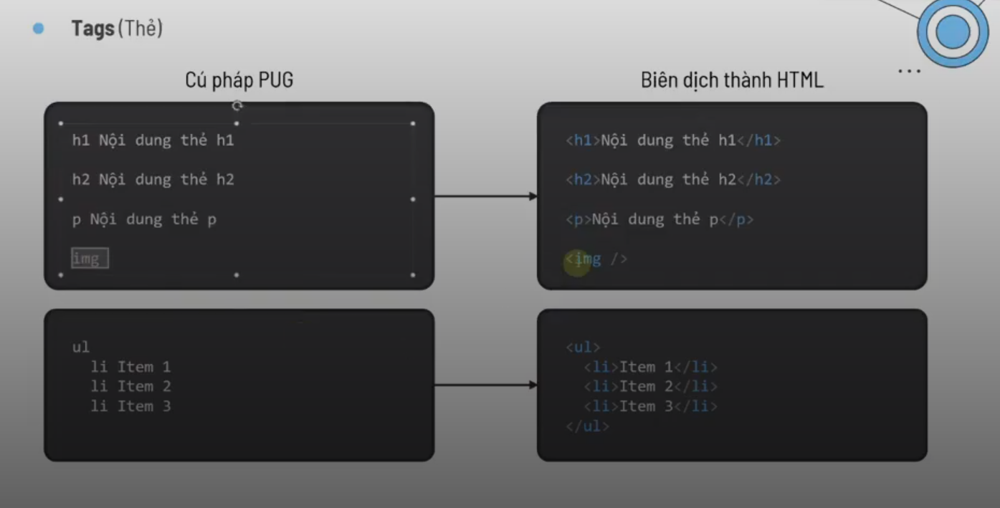</i>  
- <i>`Attributes: `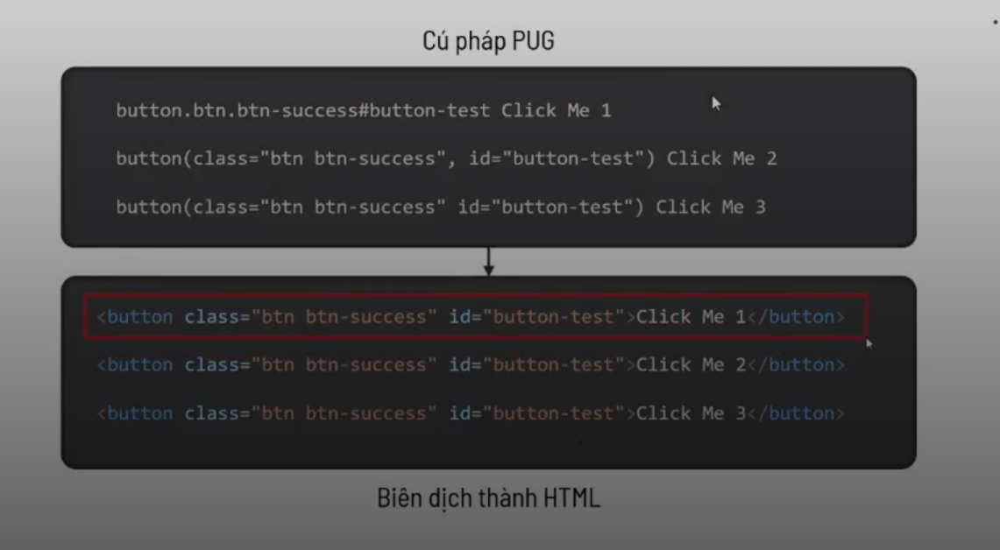</i>  
- <i>`Comments: `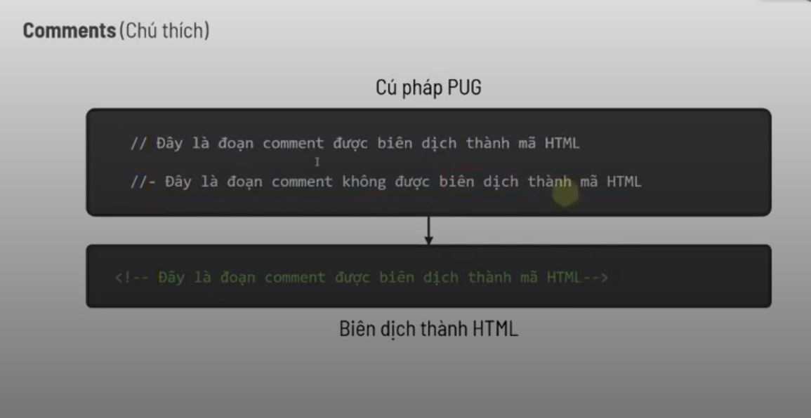</i>  
- <i>`Variables: `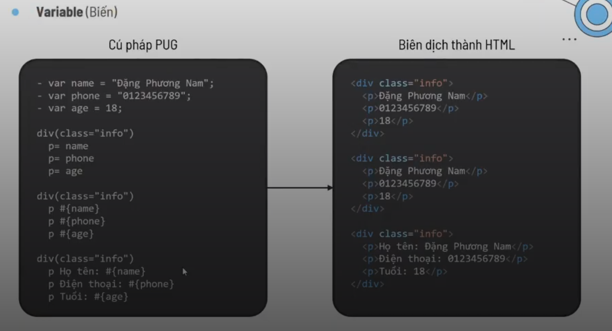</i>  
- <i>`Variables: `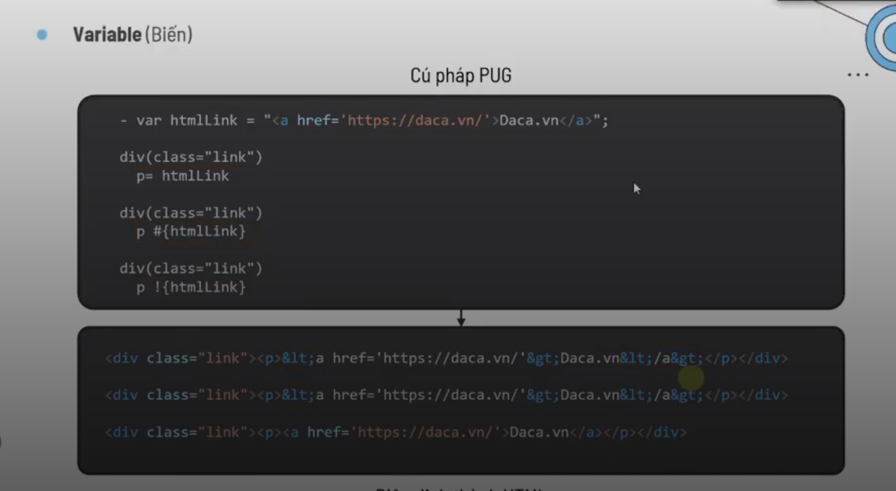</i>  
- <i>`Conditionals: `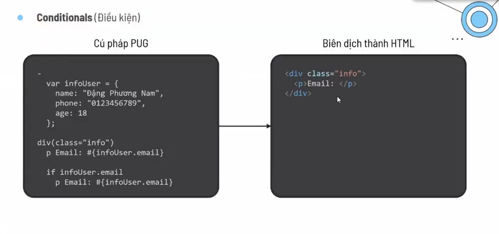</i>  
- <i>`Case: `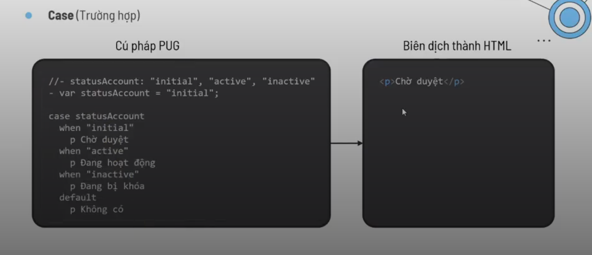</i>  
- <i>`Iteration: `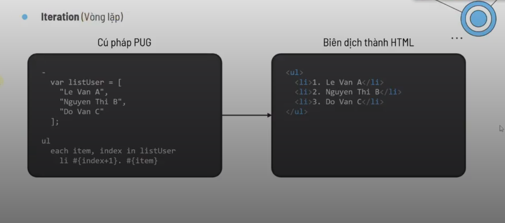</i>  

---

### Template Inheritance (kê thừa mẫu)

- <i>Dùng để tạo ra một bộ khung dùng chung cho nhiều trang</i>
- <i>Cho phép kế thừa layout từ file khác,</i>
- <i>override các block nội dung.</i>
- <i>`Bước 01` 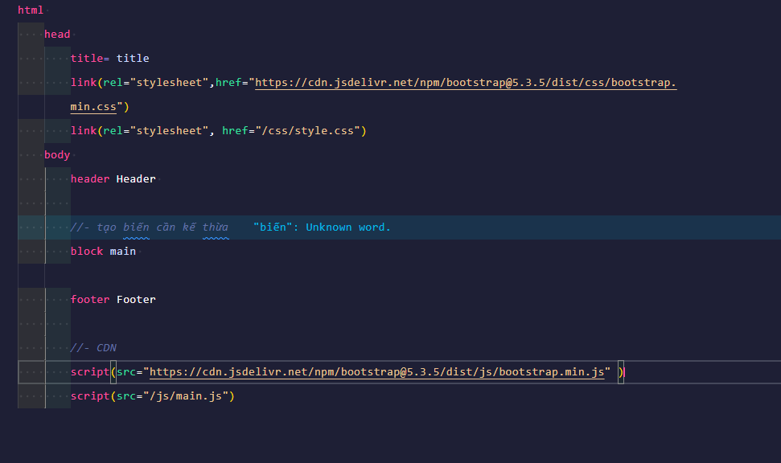</i> 
- <i>`Bước 02` 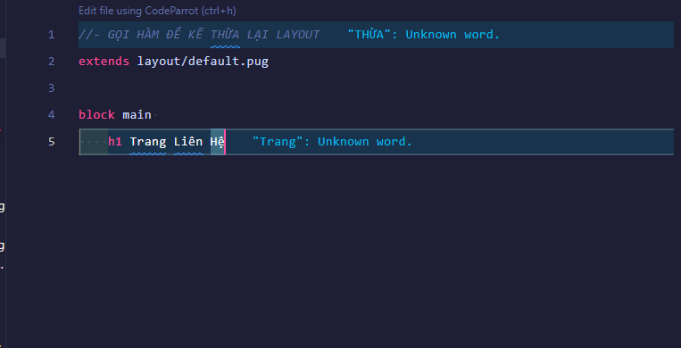</i>

---

### Includes

- <i>Dùng để nhúng nội dung của 1 file PUG vào 1 file PUG khác</i>
- <i>Không hỗ trợ block, không override.</i>
- <i>Thích hợp cho các phần tử tĩnh, lặp lại như: header, footer, sidebar...</i>
- <i>`Bước 01` 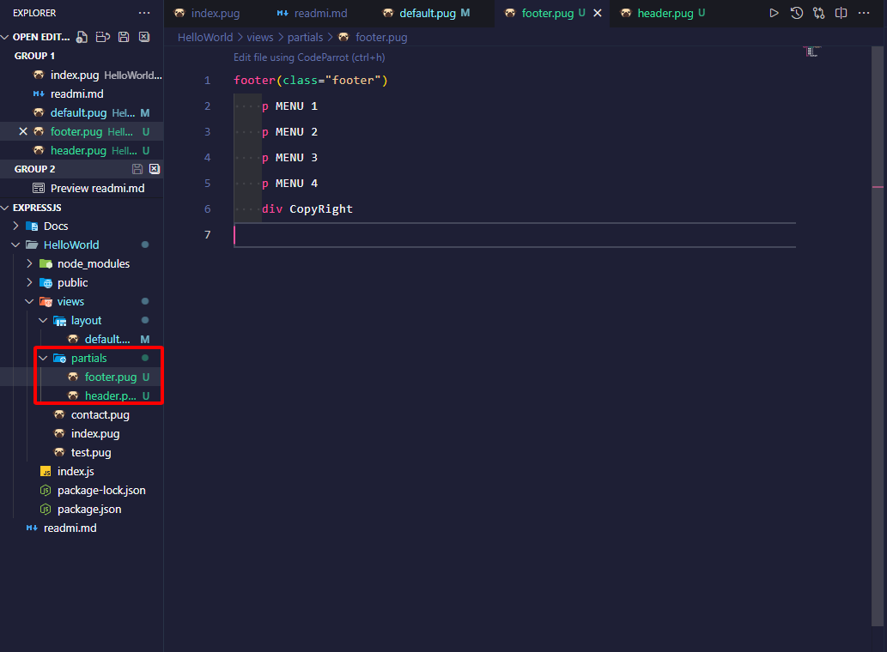</i> 
- <i>`Bước 02` 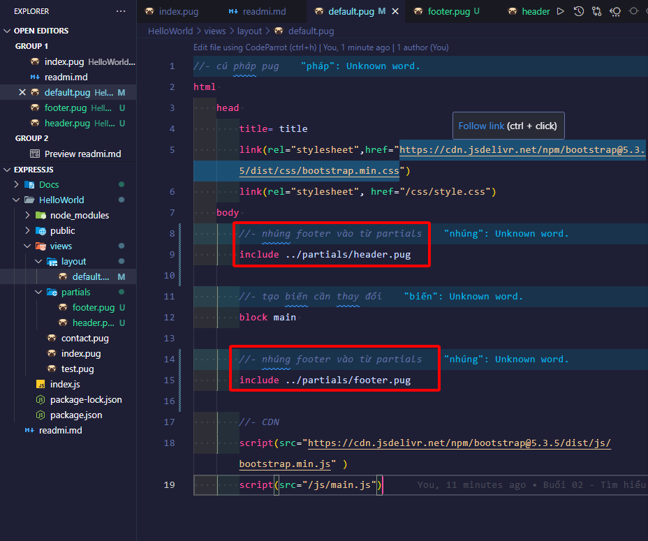</i>

---

### Mixins

- <i>Dùng để tạo ra các khối có thể tái sử dụng</i>
- <i><b>Bản chất</b>Là việc tự định nghĩa hàm và truyền tham số vào - thông qua gọi hàm để tái sử dụng</i>
- <i>`Bước 01` 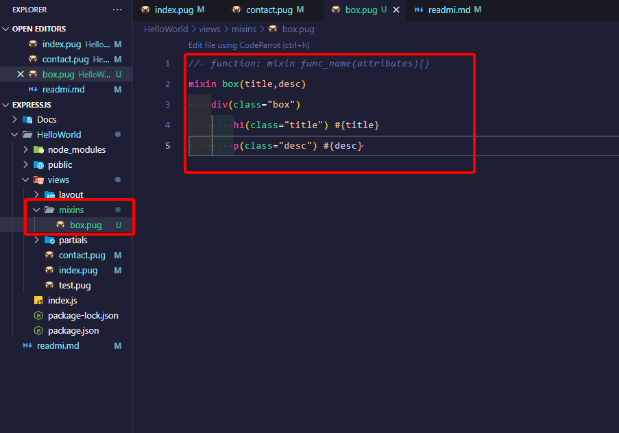</i> 
- <i>`Bước 02` 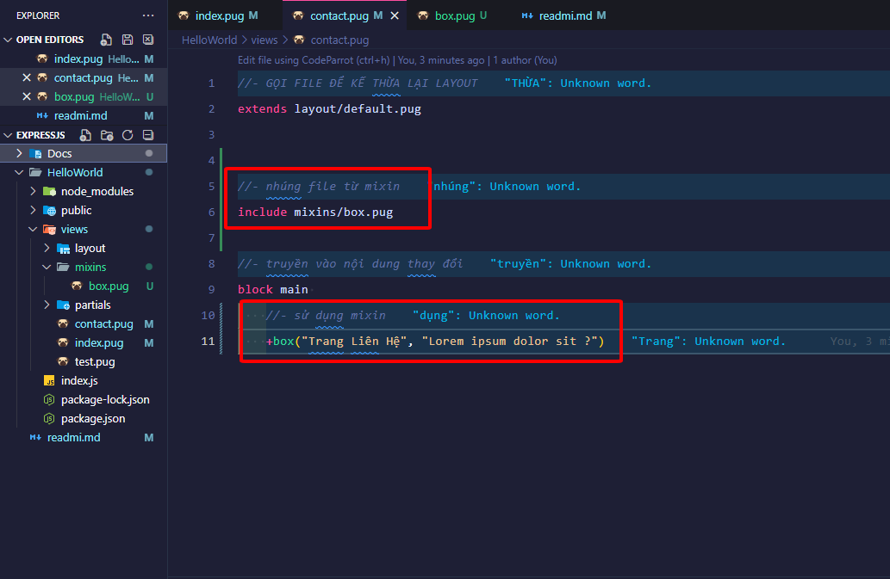</i>

---

###
